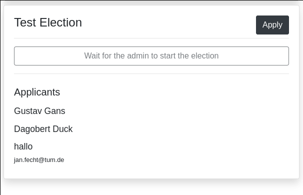
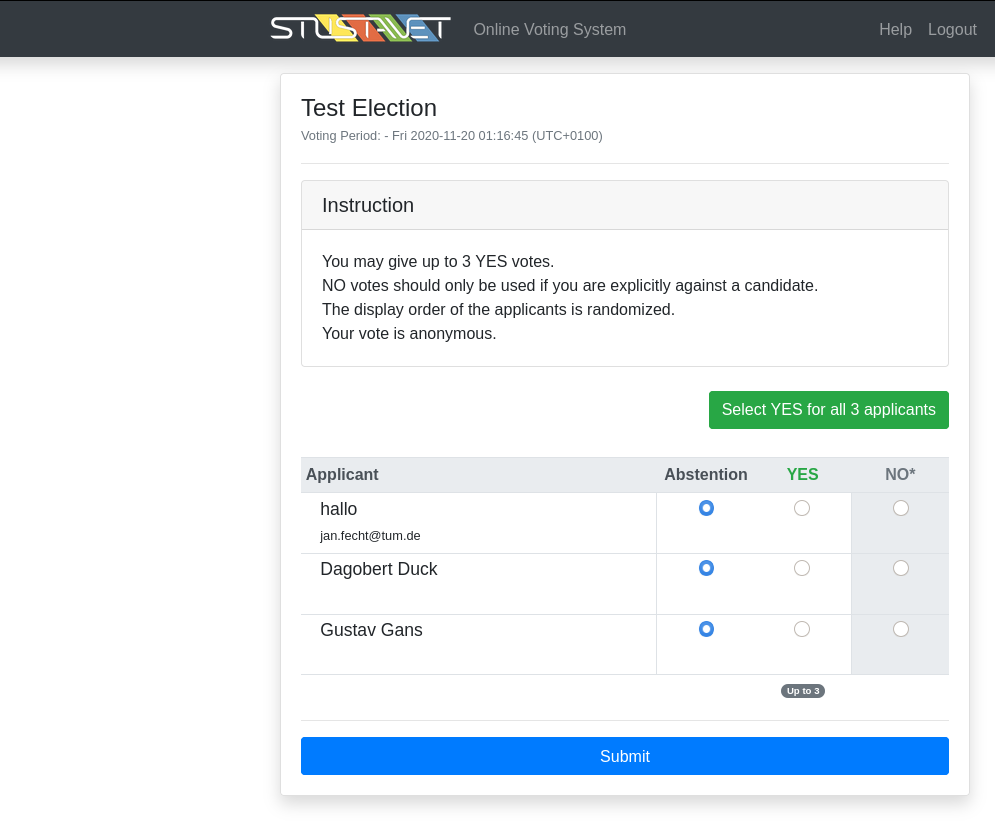
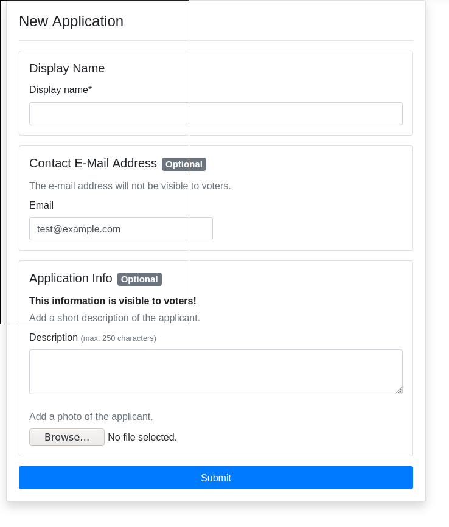

## How does voting work?

Once you are part of an election session, you should have gotten an email to the mail address that the session creator (usually the election/meeting leader) has entered for you.
If you didn't get the mail please take a look in your Spam folder and if it's not there talk to the session creator.

This mail contains a link that you can use to access the voting session.
Furthermore, a code is provided that you can enter on visiting [vote.stustanet.de](vote.stustanet.de).

### Vote Overview Page
When there was already an election created, you will be greeted with a screen similar to this one:

If enabled by the session creator, you will be able to apply by clicking the grey **apply** button in the upper right corner of the image.

Once the admin started the election, a blue *Vote Now!* button will appear (you might have to refresh the site) which you can click to open the voting page.

### Voting page

You can select all applicants that you want to give a *Yes* vote to.

The admin might have limited the number of *Yes* votes you are allowed to cast.

Don't forget to click the **Submit** button once you are done to finalize casting your vote.

### Apply page
If you want to apply for the election you and it's enabled, you can go to the overview page and click on the grey **Apply** button.

There will be a new page where you can choose a Display Name that will be shown to other people when they cast their votes.

Furthermore you can give a contact mail and a short description about yourself and also upload a picture.

Press **Submit** once you are done to apply for the election.

You can always edit your application given that the election hasn't started yet by clicking **Edit Application** or **Delete Application** in the overview page.

## How can I create a new election?

### Getting a management account

Before you are able to access the admin page, you will need a management account first.

Please send a mail to [vorstand@stustanet.de](mailto:vorstand@stustanet.de) to get a management account.

Now, visit https://vote.stustanet.de/management/ and use your credentials to log in.

### Creating a new session

On https://vote.stustanet.de/management/ there should be a big green **Create Session**. Click it.

### Create an election

### Adding applicants

## I have a problem/idea/want to contribute
## What is this all about?

[vote.stustanet.de](vote.stustanet.de) is an application that allows creating and managing secure elections and participate in them.

It was created and is maintained by the administrators of the [StuStaNet e.V.](https://stustanet.de)

### Why?

During the 2020 Covid-19 pandemic there was a big need for an online voting tool for having fair elections in the Studentenstadt Freimann (there are many events where elections are necessary).

Because other online voting tools seem insescure (see below), the StuStaNet decided to implement its own system.

### How?

vote.stustanet.de uses emails to send personal links to each voter. These mails can then be used to vote.

Usually, during a session (say a Hausvollversammlung) there will be votes on multiple things. Therefore mutliple votes are brought together into a session. This has the big advantage that the voters stay the same and only one email per voter per session is necessary.

### Why don't you just use strawpoll, doodle, ...

Creating secure online elections is a non-trivial task.

*How can you be sure that only the people allowed to vote participate?*

*How can you be sure that no one votes twice (e.g. via a second account or by reloading the site)?*

Most online voting tools consist of a single link that each voter can use to access a webpage where they can cast their vote. Nothing stops voters to share the link with other people.

vote.stustanet.de solves this problem by sending each voter a personal access link where it's only possible to vote once for each election.

*How can you be sure that the election host doesn't access your data/keeps the data after the election?*

Many online election tools are based in foreign countries and often have an incentive to gain money by tracing your activities online and placing ads.

The administrators of StuStaNet e.V. are volunteers that you might know in person. All election data is deleted once a session is removed. The source code of vote.stustanet.de is open source and available [here](https://github.com/stustanet/wahlfang).
